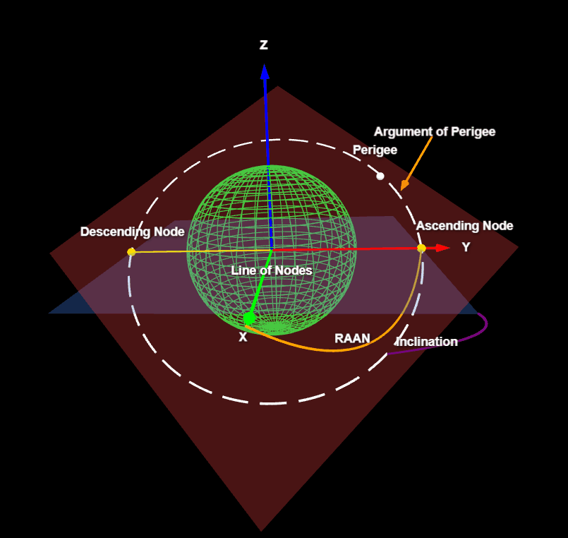

# Orbital Elements

Modeling the orbital elements using [three-d](https://github.com/asny/three-d) (Rust + WebAssembly).



Inspired by this NASA Orbital Elements video:
https://youtu.be/Am7EwmxBAW8

## Build / Run

Requires:
- Rust (with the `wasm32-unknown-unknown` target installed: `rustup target add wasm32-unknown-unknown`)
- [Trunk](https://trunkrs.dev) (`cargo install trunk`)

Then:

```
trunk serve --open
```

For a production build:

```
trunk build --release
```

The bundled output lives in `dist/`.

## Notes on the Rust port

This was originally a Three.js sketch (see git history). The Rust/`three-d` port
matches the original closely: green wireframe Earth, dashed white orbit ellipse,
semi-transparent equatorial and orbital planes, and the X/Y/Z/RAAN/Inclination/
Perigee labels as HTML overlays projected onto the scene each frame.
